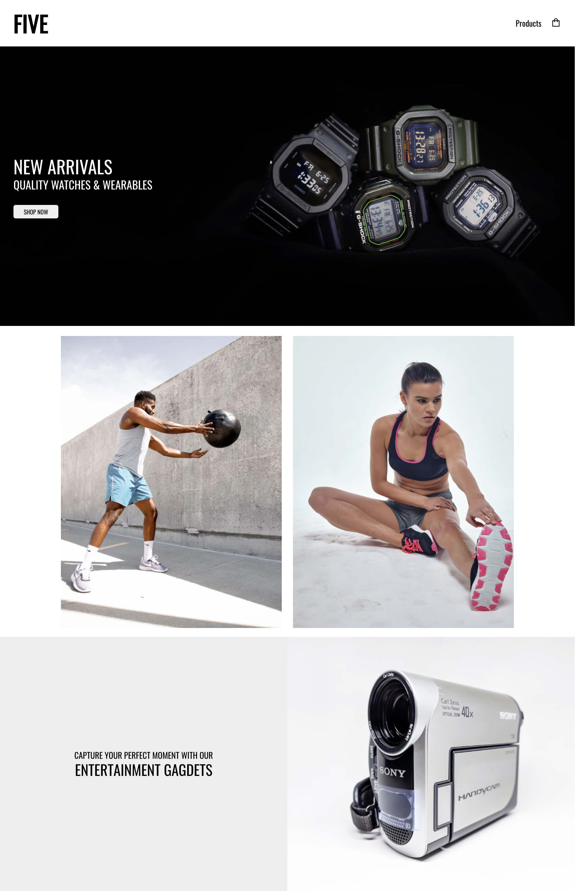
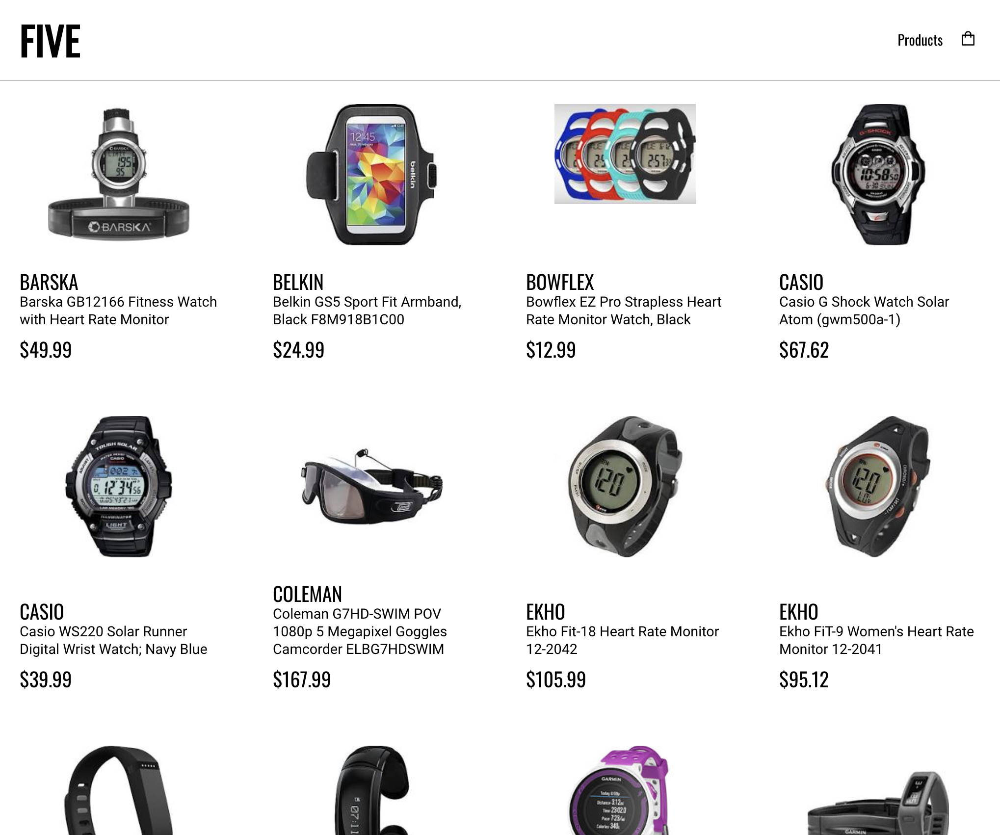
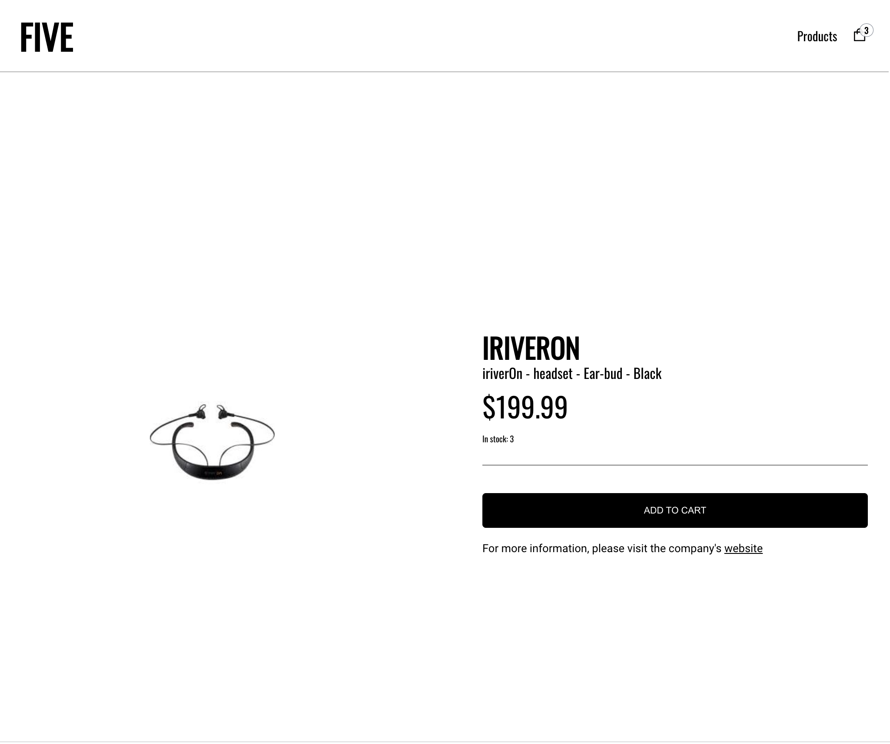
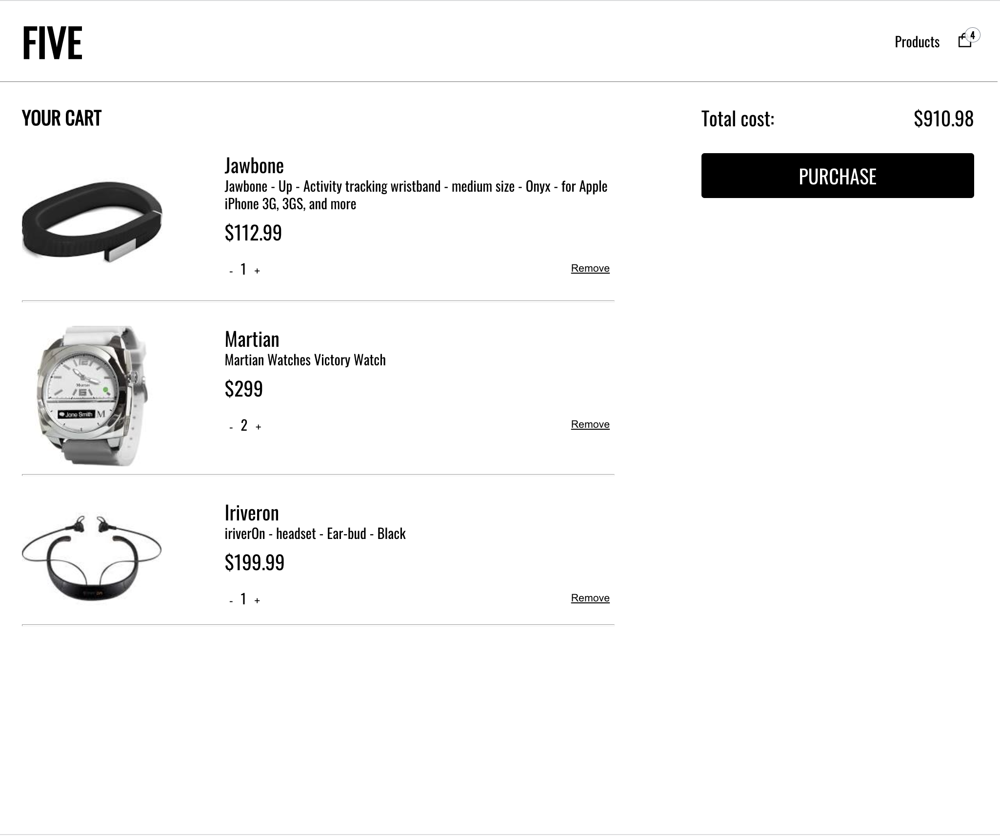

# Five

## Introduction

**Five** is an ecommerce group project. The store displays a variety of products that can be added to the cart and purchased.

I was responsible for writing the whole backend as well as the frontend cart functionality, React product details hook, reducer, some component refactoring and some CSS. Also, I converted the frontend from JavaScript to TypeScript.

## Creators

- https://github.com/Esn024
- https://github.com/helen-tran
- https://github.com/flcheng
- https://github.com/obloj91

## Launching the app

Frontend:

- cd client
- yarn install
- yarn start

Server:

- cd server
- yarn install
- yarn start

# Project

## Tech used for project

- HTML
- CSS
- JavaScript
- TypeScript
- React
- NodeJS
- Express
- Morgan
- emotion-js
- Material UI
- styled-components
- uuid
- Figma (for the design)
- Insomnia (for the API testing)

## Home

The home page shows a variety of products.

## Products

On the products page, it lists out all the products from the server in alphabetical order.

## Product details

The product details page includes the link to the website of the brand, as well as the price of the product and the amount of stock left. If there is no more stock, the button will be disabled. When the product is added, the number on the cart icon increases as well.

## Cart

On the cart page, we can increase/decrease the quantity of the each product or completely remove it from the basket. It also indicates the total cost for the items in the cart.

## Backend

The store inventory data is stored in a local JSON file that is updated whenever any permitted changes are made.

There is an API with a number of endpoints. You can do the following:

- get data for all products
- get data for one product
- purchase stock of one or more products
- get data for all companies
- get data for one company
- get a list of all unique item "body locations"
- get a list of all unique item "categories"
